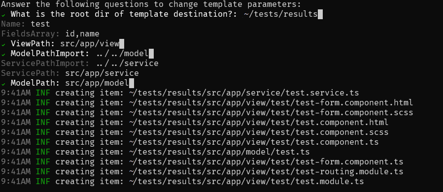

# Amestris

An MV tool to simplify template generation. This tool aims to help speed up template generation for common projects templates such as CRUDs and project start based on file templating.

[](https://github.com/mv-sistemas/amestris/actions/workflows/build.yml)
## Getting started
1. Setup Go Programming Language
1. Clone the repo on [github](https://github.com/mv-sistemas/amestris)
1. Install the project dependencies:
    ```bash
    go get -u all
    ```
1. Open with your favorite editor, and happy codding 😊.
    
    
## Usage/Examples

### Screenshots



### Example of use
``` bash
amestris -t  ~/templates/project
```

### Flags
| Name       | Shortcut | Description                               |
| :--------- | :------- | :-------------------------                |
| `template` | `-t`     | **Required**. Path to you template folder |
| `help`     | `-h`     | display help of cli                       |
| `help`     | `-v`     | display the version of cli                |

### Contraints and limitations
The template processing depends on the golang standard template package, thus some limitations are inherent to the package. Check the package documentation on https://pkg.go.dev/text/template. 

Besides that due some limitations we decide that in order to process variables of type array, we would expect that the variables of type array should end with `Array`. 

The same with camelcase notation, we would expect a variable that ends with `CamelCase` and also this variable should have a matching variable with the same name minus `CamelCase`, e.g. `Name` and `NameCamelCase`.


